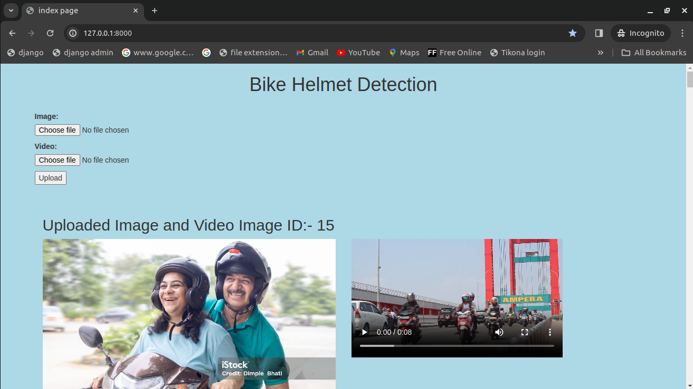
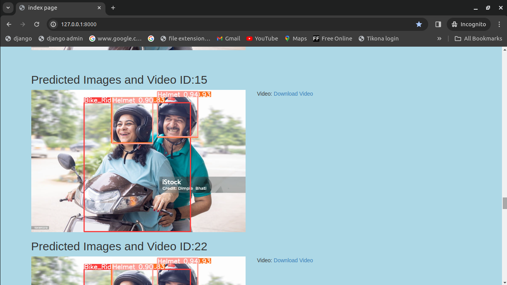
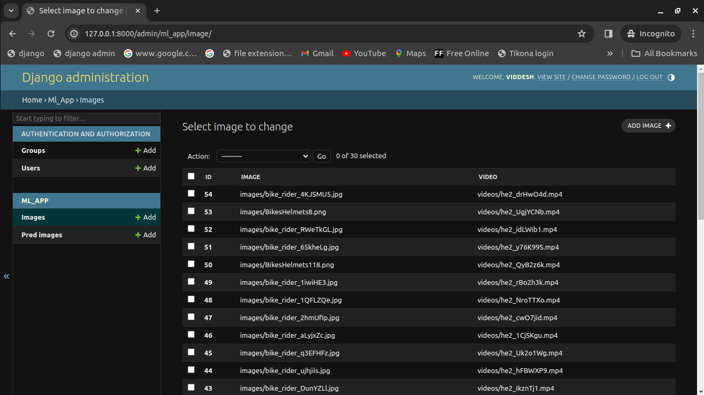
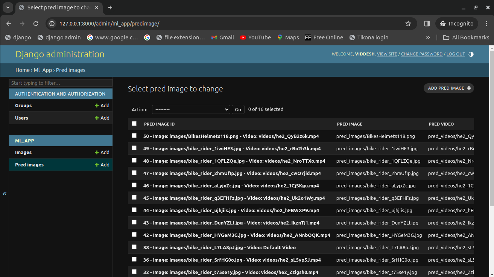
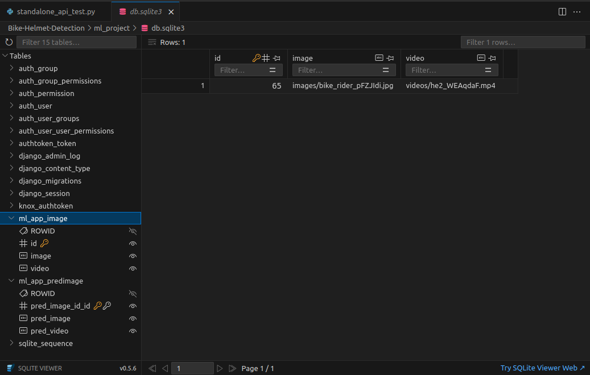
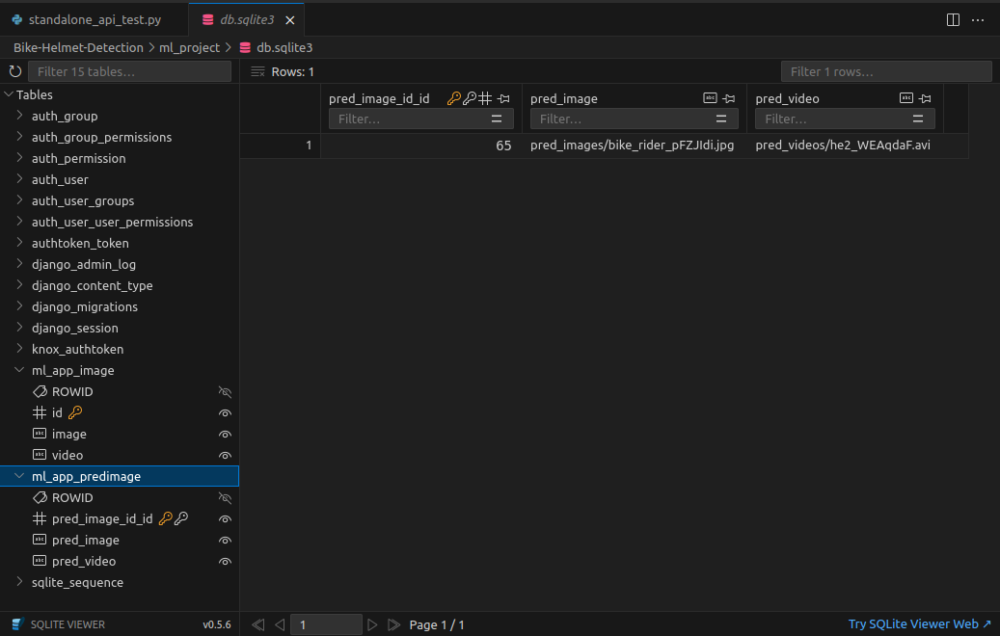
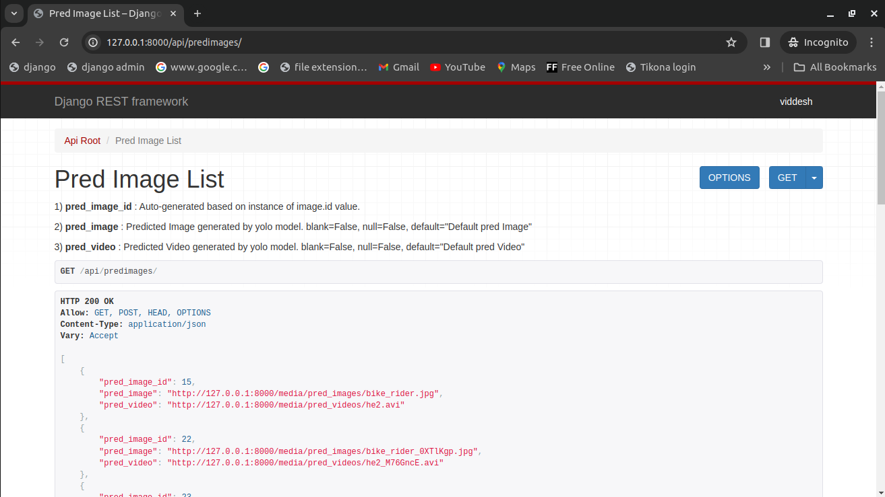

# Bike-Helmet-Detection
This repository contains the implementation of Bike helmet detection using YOLOv8 using Django. This project contains django web application where end user can fill a form which contains image and video to be submited at the front-end or through API end point for prediction of the **bike rider**, **helmet** and **no helmet**. Validation is done on both front-end and API as a result only if both the fields are submited for prediction then only detection will be done else appropriate error message are displayed. Images and Videos that submited by end users are then ran inference on by YOLO model and displayed on index page which is same page. For sending valid data via API, images and videos are processed and appropriate predicted image and videos with auto generated id is send back to end user. 


# Key Features
1) Github actions workflow for test with tox.   <br />
2) Unit testing test cases is done for testing modules. <br />
3) API is ceated using django-rest-framework.   <br />
4) API documentation is created using markdown. <br />
5) coverage report is generated.    <br />
6) For sorting imports isort is used.   <br />
7) For code formating  / linting black is used. <br />
8) For static type checking mypy is used (optional).    <br />
9) Respective validations are done to the fields.   <br />
10) Containerized with docker.  <br />
11) kubernetes.yaml file to test with kubernetes in docker and minikube.    <br />


# Techology used
1) Front end :- HTML, CSS, Bootstrap    <br />
2) Backend :- Python (Django, DRF)  <br />
3) Database :- Sqlite (Default)     <br />


# Major python libraries used for the project
```text
# This are the major packages for this project

Django==5.0.1       # For Django web application development
ultralytics==8.1.9  # For running inference on YOLOv8 model and getting results.
pillow==10.2.0      # For images and videos files

# Test Coverage
coverage==7.4.3    # For generating test coverage report

# Django-rest Framework
django-filter==23.5 # Simple way to filter down a queryset based on parameters of user
djangorestframework==3.14.0 # For API development 
Markdown==3.5.2 # pip install markdown # For API documentation

# Re-Structing the codebase
isort==5.13.2   # For sorting imports
black==24.3.0   # For python code formatting / linting
tox==4.14.2     # To run tests on different OS and python environments
mypy==1.9.0     # Static type checker (optional)
```

# File Structure
```text
Bike-Helmet-Detection
├── .git # Git file to version control
├── .github # Github file for workflows
│   ├── ISSUE_TEMPLATE # Github issue template
│   │   ├── bug_report.yml # bug report issue form template
│   │   ├── config.yml  # issue config 
│   │   ├── feature_request.yml #  feature request form template
│   │   └── pull_request_template.md # custom PR template 
│   └── workflows # Github workflow to run after a PR
│       └── main.yml 
├── .gitignore # Gitignore file to ignore any unncessary files by git
├── ml_project  # Django project file
│   ├── compose.yaml # Docker compose file to manage docker containers
│   ├── Dockerfile # Docker file to create a image and run using docker compose or docker build
│   ├── kubernetes.yaml # Kubernetes configuration file for kubernetes, minikube
│   ├── README.Docker.md # Docker md file
│   ├── .dockerignore # Docker ignore file to ignore any unnecessary files by docker
│   ├── .coverage # Hidden coverage file
│   ├── .coveragerc # Coverage configuration file to work on local
│   ├── db.sqlite3 # Default database for django
│   ├── deployment_req.txt # Deployment requirements for docker and any other platform
│   ├── htmlcov # Generated by coverage "coverage html" command open index.html to see coverage
│   ├── major_packages.txt # Major packages needed for project
│   ├── manage.py # Django's command-line utility for administrative tasks
│   ├── media # Media static files for django for images or videos
│   │   ├── images
│   │   │   ├── bike_rider_JlJpRzO.jpg
│   │   │   ├── bike_rider.jpg
│   │   │   ├── BikesHelmets118.png
│   │   │   ├── BikesHelmets8.png
│   │   │   └── test_image.jpg
│   │   ├── pred_images
│   │   │   ├── bike_rider_0XTlKgp.jpg
│   │   │   ├── bike_rider.jpg
│   │   │   ├── BikesHelmets118.png
│   │   │   └──test_pred_image.jpg
│   │   ├── pred_videos
│   │   │   ├── he2_1CjSKgu.avi
│   │   │   ├── he2.avi
│   │   │   ├── test_pred_image.mp4
│   │   │   └── test_pred_image_yiShPOt.mp4
│   │   └── videos
│   │       ├── he2_M76GncE.mp4
│   │       ├── he2.mp4
│   │       ├── test_video_0BeuZlt.mp4
│   │       ├── test_video.mp4
│   │       └──test_video_MqdGYhL.mp4
│   ├── ml_app # Dajngo web app for this project
│   │   ├── admin.py # Django admin utility
│   │   ├── apps.py # Django app utility
│   │   ├── assets # Assets for testing ml_app in UI and API
│   │   │   ├── Images
│   │   │   │   ├── bike_rider.jpg
│   │   │   │   ├── BikesHelmets64.png
│   │   │   │   ├── BikesHelmets66.png
│   │   │   │   └── BikesHelmets6.png
│   │   │   └── Videos
│   │   │       ├── he2.mp4
│   │   │       ├── test_1.mp4
│   │   │       └── test_2.mp4
│   │   ├── credentials.py # My root username and password
│   │   ├── forms.py # Django form utility for rendering UI forms
│   │   ├── __init__.py
│   │   ├── .isort.cfg # Isort configuration file
│   │   ├── migrations # Generated by makemigrations and migrate command for DB
│   │   │   └──  0001_initial.py
│   │   ├── models.py # Database models
│   │   ├── pyproject.toml # Configuration for running tox, mypy
│   │   ├── serializers.py # DRF utility for serilization and deserlization
│   │   ├── standalone_api_test.py # Standalone test for api
│   │   ├── static # static files for webapp
│   │   │   └── ml_app
│   │   │       └── style.css # Custom css file
│   │   ├── templates
│   │   │   └── ml_app
│   │   │       └── index.html # Custom html file
│   │   ├── tests # Testcases packages for ml_app 
│   │   │   ├── __init__.py
│   │   │   ├── test_assets # Test images and videos for testcases
│   │   │   │   ├── test_images
│   │   │   │   │   ├── bike_rider.jpg
│   │   │   │   │   ├── BikesHelmets64.png
│   │   │   │   │   ├── BikesHelmets66.png
│   │   │   │   │   └── BikesHelmets6.png
│   │   │   │   └── test_videos
│   │   │   │       ├── he2.mp4
│   │   │   │       ├── test_1.mp4
│   │   │   │       └── test_2.mp4
│   │   │   ├── test_forms.py # Testcase for forms
│   │   │   ├── test_model.py # Testcase for models.py file
│   │   │   ├── test_urls.py  # Testcase for urls.py
│   │   │   └── test_views.py # Testcase for views.py
│   │   ├── .tox
│   │   ├── urls.py     # Django utility for URL routing
│   │   ├── utils.py    # Custom function for YOLOv8 model inference 
│   │   ├── views.py    # Django utility backend logic for web_app and api 
│   │   ├── web_cam.py  # Python script to run on local webcam
│   │   └── weights     # Model weights of YOLOv8
│   │       ├── best.pt # Best model for YOLOv8
│   │       ├── information.txt
│   │       └── last.pt # Last model for YOLOv8
│   ├── ml_project
│   │   ├── asgi.py
│   │   ├── __init__.py
│   │   ├── settings.py # Django settings for ml_app
│   │   ├── urls.py # URL routing for ml_app and api
│   │   └── wsgi.py
│   ├── requirements.txt # pip install -r requirements.txt command for local development
│   ├── runs # Generated by ultralytics yolov8 predictions
│   └── tox.ini # tox configurations
├── tree_all.txt # All the file tree structure including hidden files using tree -a > tree_all.txt
├── tree.txt # File tree structure excluding hidden files using command tree > tree.txt
└── README.md # This file itself

```

# Root username and password
```text
USERNAME = "viddesh"
PASSWORD = "!@#$%^&*()_+"
```

# Other Dependencies
```text
python version :- 3.10.12 (local)
Docker version :- Docker version 25.0.3, build 4debf41
minikube version :- v1.32.0
kubectl Client version :-  v1.29.2
```

# API end endpoints information
1) http://127.0.0.1:8000/ --> Run's Django webapp   <br />
2) http://127.0.0.1:8000/admin/ --> Django admin panel  <br />
3) http://127.0.0.1:8000/api/ --> Default router root view  <br />
4) http://127.0.0.1:8000/api/images/ --> End user submitted image and video list api    <br />
5) http://127.0.0.1:8000/api/predimages/ --> Predicted image and videos api <br />


# How to run this django project locally?
```shell
python3 -m venv .venv
source .venv/bin/activate
unset VIRTUAL_ENV && exec $SHELL # # To deactivate the virtual environment
git clone https://github.com/Viddesh1/Bike-Helmet-Detection.git
cd Bike-Helmet-Detection/
pip install -r requirements.txt
cd ml_project/
python3 manage.py makemigrations
python3 manage.py migrate
python3 manage.py runserver # web app will run on http://127.0.0.1:8000/
```

# Run Test Cases 
```shell
cd ml_project/
python3 manage.py test ml_app
```

# Run isort
```shell
cd ml_project/ml_app/
isort .
```

# Run Black 
```shell
cd ml_project/ml_app/
black .
```

# Run tox
### Github actions takes care of running tox (remote)
```shell
cd ml_project/
tox
```
OR
```shell
cd ml_project/ml_app/
tox
```
# Run coverage report
```shell
cd ml_project/
coverage run manage.py test ml_app
coverage report -m
coverage html # To generate html report
```
# Run on Docker
### Make sure docker demon is running using docker-desktop
```shell
cd ml_project/
docker compose up
```
# Run kubectl using docker in kubernetes
### Make sure docker demon is running using docker-desktop and kubernetes is enable in docker desktop settings
```shell
cd ml_project/
kubectl config get-contexts
kubectl config use-context docker-desktop
kubectl apply -f kubernetes.yaml
kubectl get pods
```
# Run kubectl using minikube
```shell
cd ml_project/
kubectl config get-contexts
kubectl config use-context minikube
minikube start
minikube kubectl -- apply --filename my-deployment.yaml
minikube stop
```
# Inference on Video
<iframe width="700" height="500"
  src="/dj_bhd_videos/Traffic_2.mp4">
</iframe>

<!-- <video width="700", height="500" controls>
    <source src="/dj_bhd_videos/Traffic_2.mp4" type="video/mp4">
</video> -->

# Inference on Image


# Demo
### Index Page
 <br /> <br /> 
 <br /> <br />

### Django admin panel
 <br /> <br />
 <br /> <br />

### Sqlite3 database
 <br /> <br />
 <br /> <br />

### API end points
 <br /> <br />
 <br /> <br />

### API Testing from standalone_api_test.py
```python
response = requests.get(url = f'{base_url}/api/', auth=(credentials.USERNAME, credentials.PASSWORD))
json_str = json.dumps(response.json(), indent=4)
print(json_str)

(.venv) viddesh@viddesh-desktop:~/Desktop/Webapp1/Bike-Helmet-Detection/ml_project/ml_app$ python3 standalone_api_test.py 
{
    "images": "http://127.0.0.1:8000/api/images/",
    "predimages": "http://127.0.0.1:8000/api/predimages/"
}
```
```python
# Sample data for creating an Image
image_data = {
    'image': open(os.path.join(os.getcwd(), "tests", "test_assets", "test_images", "bike_rider.jpg"), 'rb'),
    'video': open(os.path.join(os.getcwd(), "tests", "test_assets", "test_videos", 'he2.mp4'), 'rb')
}

# Send a POST request to create a new Image
response = requests.post(image_url, auth=(credentials.USERNAME, credentials.PASSWORD), files=image_data)
# print('Image API Response:', response.status_code, response.json())
json_str = json.dumps(response.json(), indent=4)
print(json_str)

(.venv) viddesh@viddesh-desktop:~/Desktop/Webapp1/Bike-Helmet-Detection/ml_project/ml_app$ python3 standalone_api_test.py 
{
    "id": 65,
    "image": "/media/images/bike_rider_pFZJIdi.jpg",
    "video": "/media/videos/he2_WEAqdaF.mp4"
}
```
```python
# Get the latest response from GET request.
response = requests.get(url = f'{base_url}/api/images/65/', auth=(credentials.USERNAME, credentials.PASSWORD))
json_str = json.dumps(response.json(), indent=4)
print(json_str)

# GET the POST response that I just did.
response = requests.get(url = f'{base_url}/api/predimages/65/', auth=(credentials.USERNAME, credentials.PASSWORD))
print(f"Status code: {response.status_code}")
json_str = json.dumps(response.json(), indent=4)
print(json_str)

(.venv) viddesh@viddesh-desktop:~/Desktop/Webapp1/Bike-Helmet-Detection/ml_project/ml_app$ python3 standalone_api_test.py 
{
    "id": 65,
    "image": "/media/images/bike_rider_pFZJIdi.jpg",
    "video": "/media/videos/he2_WEAqdaF.mp4"
}
Status code: 200
{
    "pred_image_id": 65,
    "pred_image": "http://127.0.0.1:8000/media/pred_images/bike_rider_pFZJIdi.jpg",
    "pred_video": "http://127.0.0.1:8000/media/pred_videos/he2_WEAqdaF.avi"
}
```


# Also see
1) https://github.com/Viddesh1/Helmet_test_1    <br />
2) https://github.com/Viddesh1/Bike-Helmet-Detectionv2  <br />