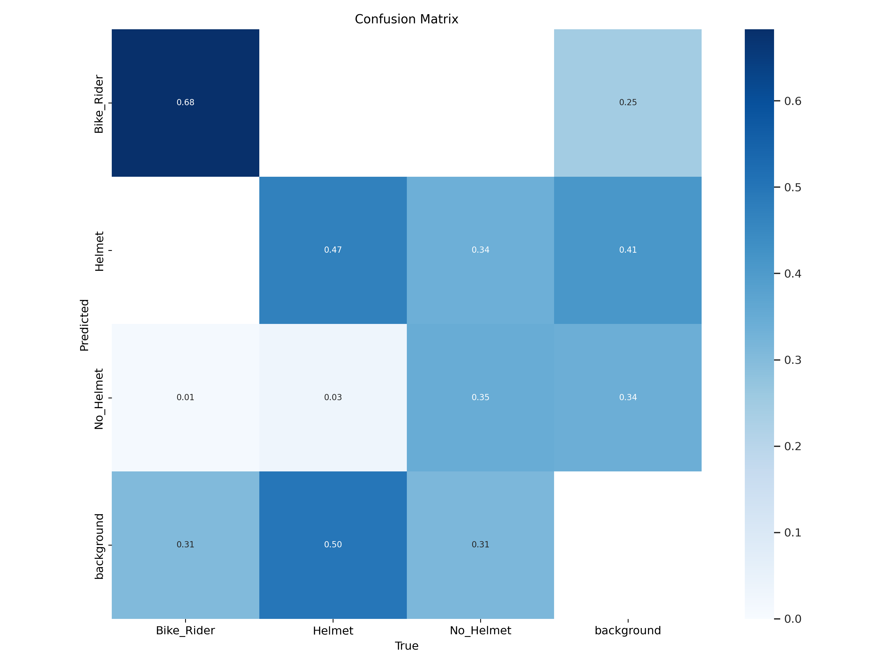
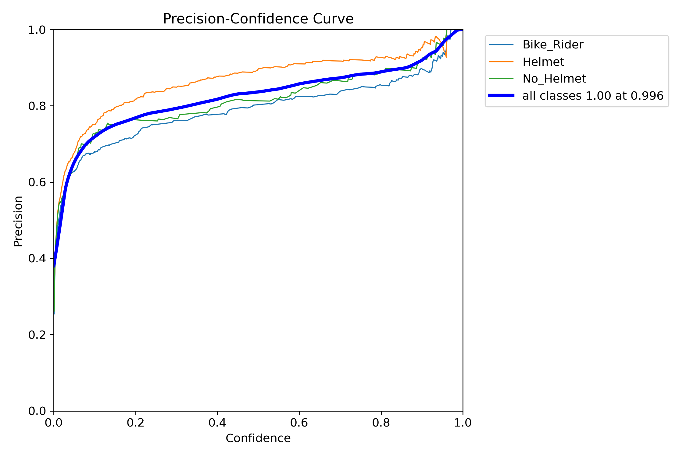
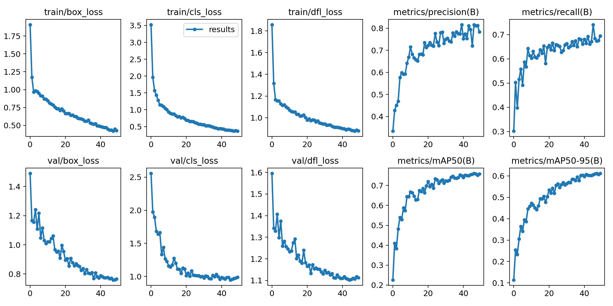
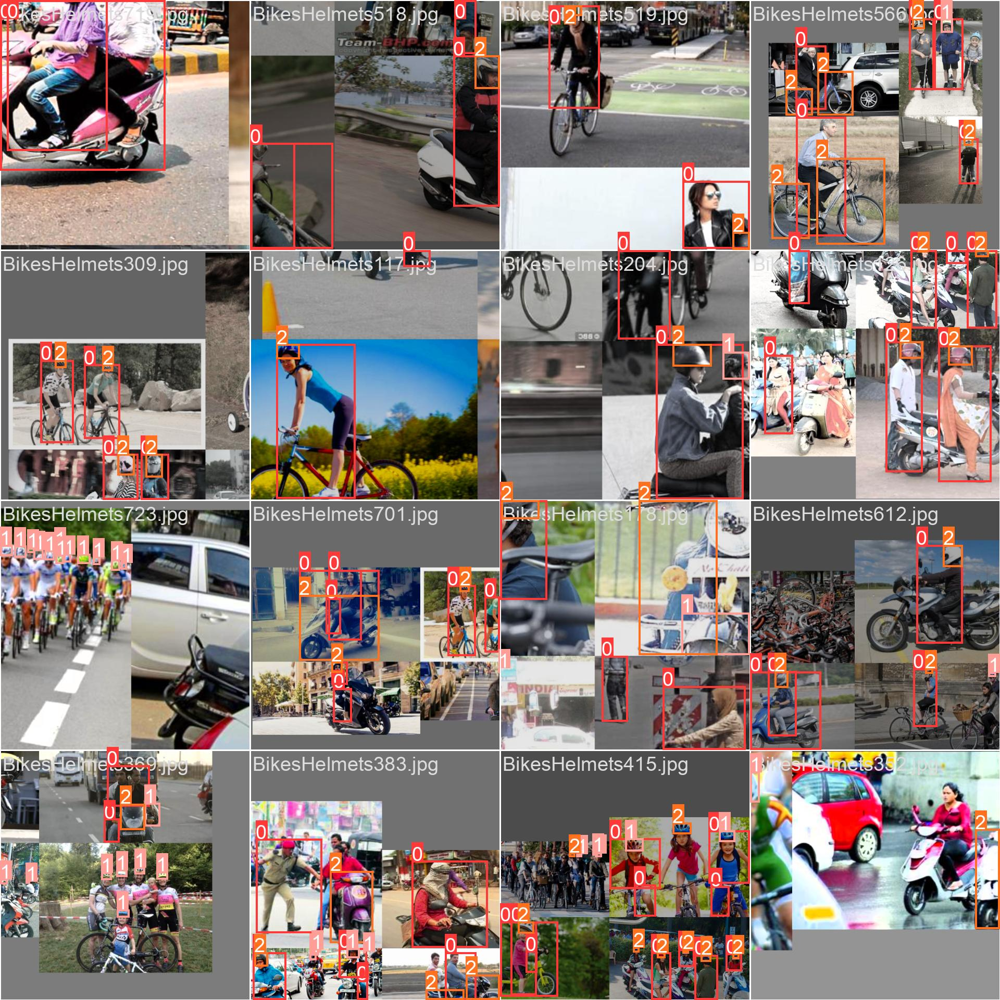
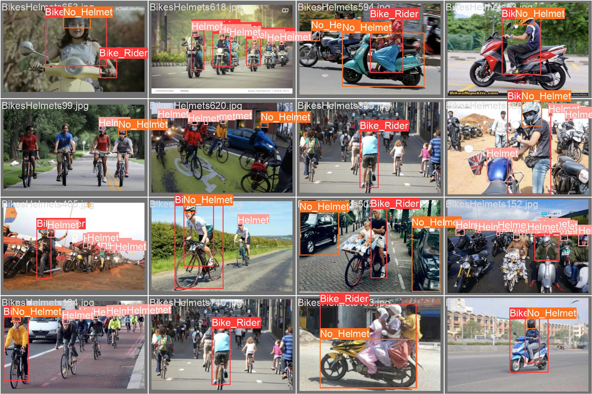
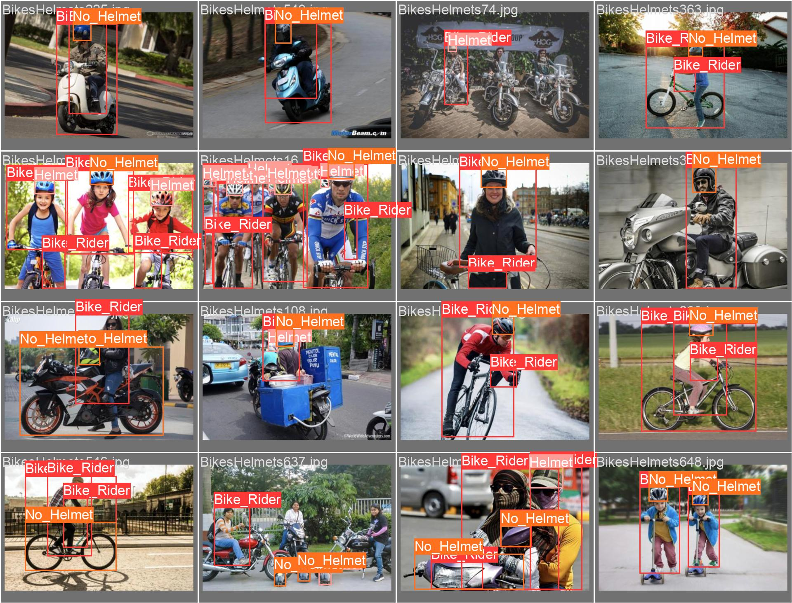
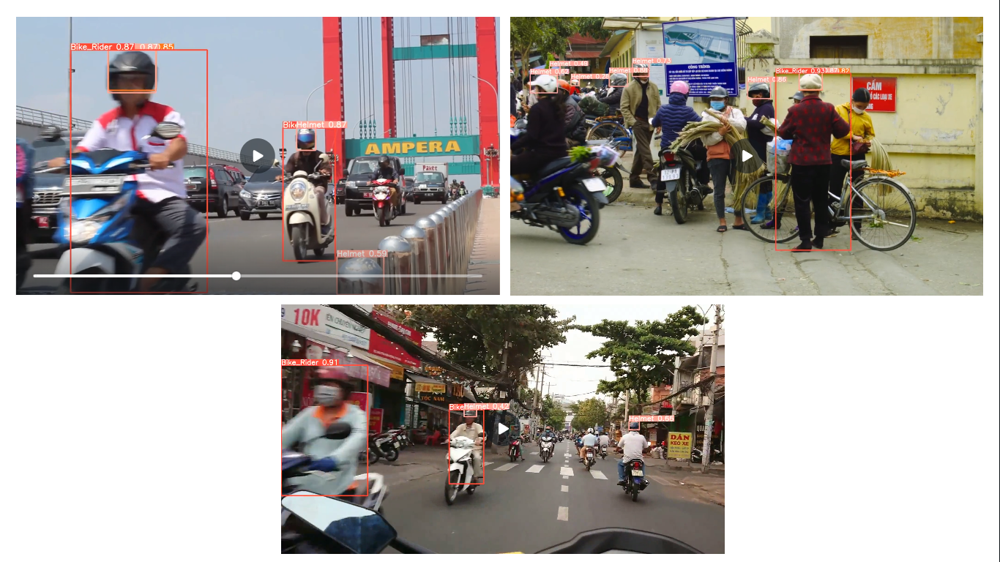
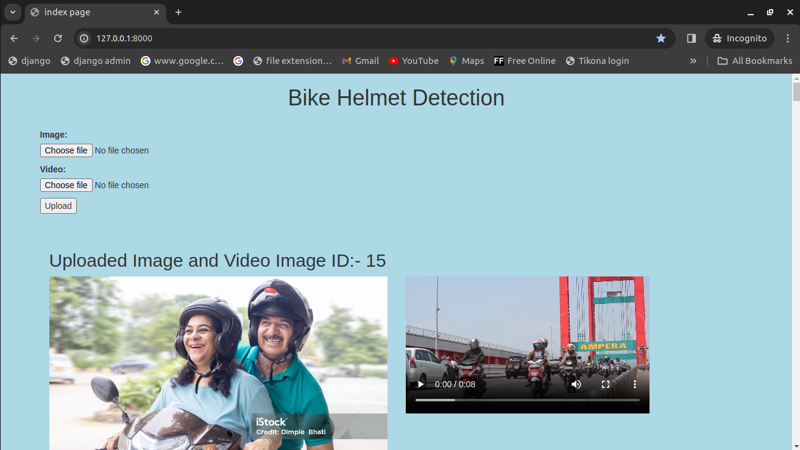
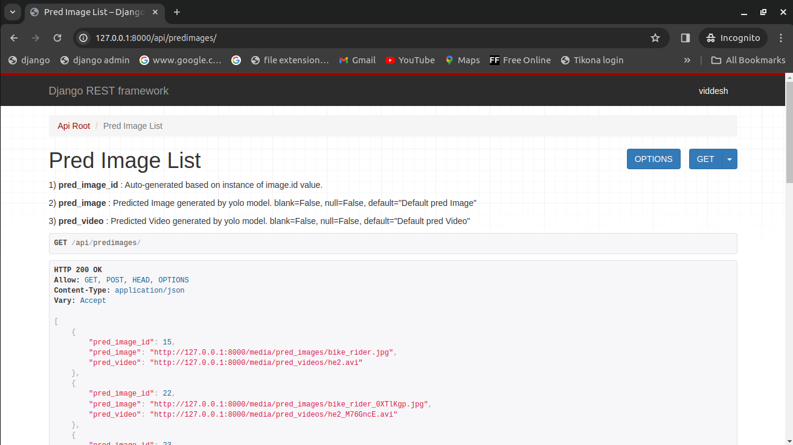
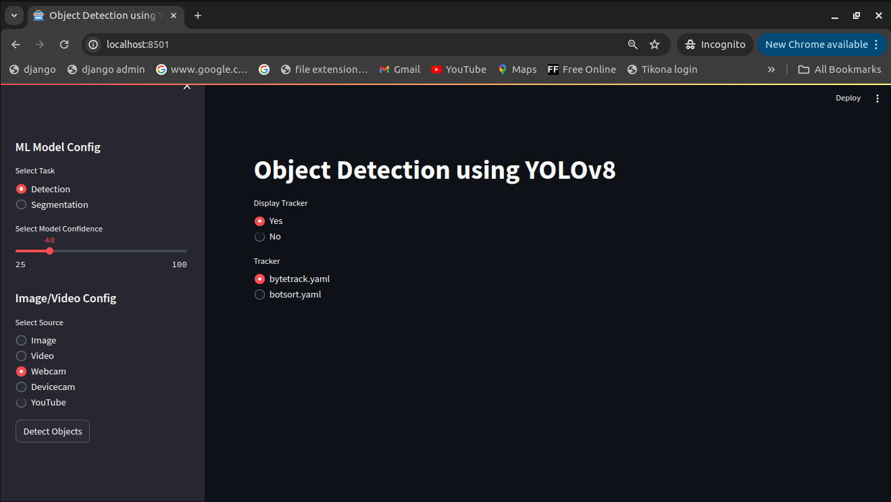

# Bike Rider Helmet Detection


## Abstract

Bike rider helmet detection is a crucial computer vision task aimed at improving
road safety by identifying bike rider who are not wearing helmets. This system
leverages deep learning models, such as YOLOv8, to accurately detect helmets
in real-time or from images or video streams. It can be integrated into traffic
monitoring systems to automatically flag violations and enhance law enforcement
efficiency. The implementation involves preprocessing images, training the model,
and saving the model. I have also created a streamlit and django web application
and deployed the web application in streamlit cloud. The proposed system helps
reduce head injuries and fatalities in bike rider accidents by promoting helmet use. <br />

-----

## Index

| Sr. No | Topic                                      |
|:--------:|:--------------------------------------------|
| 1      | 1) Introduction                            |
|        | 1.1) Computer Vision: Introduction         |
|        | 1.2) Bike Rider Helmet Detection: Introduction |
| 2      | 2) Objective                               |
|        | 2.1) Problem                               |
|        | 2.2) Goal                                  |
| 3      | 3) Tools and Technology                    |
|        | 3.1) Hardware Requirements                 |
|        | 3.2) Software Requirements                 |
| 4      | 4) Literature Review                       |
|        | 4.1) Image Acquisition                     |
|        | 4.2) Image Preprocessing                   |
|        | 4.3) Feature Extraction                    |
|        | 4.4) Object Detection and Recognition      |
|        | 4.5) Image Segmentation                    |
|        | 4.6) Motion Analysis                       |
|        | 4.7) Scene Understanding                   |
| 5      | 5) Methodology                             |
|        | 5.1) Data Collection                       |
|        | 5.2) Data Pre-processing                   |
|        | 5.3) Model Training                        |
|        | 5.4) Model Evaluation                      |
|        | 5.5) Model Testing                         |
|        | 5.6) Deployment                            |
| 6      | 6) Implementation Details                  |
|        | 6.1) Dataset Used                          |
|        | 6.2) YOLOv8 Metrics                        |
|        | 6.3) What is YOLOv8?                       |
|        | 6.4) Why YOLOv8?                           |
|        | 6.5) What is Ultralytics?                  |
|        | 6.6) What are Base Models?                 |
|        | 6.7) What are Target Models?               |
|        | 6.8) How Pre-processing of the Dataset is Done? |
|        | 6.9) How Images are Pre-processed?         |
|        | 6.10) How Videos are Pre-processed?        |
|        | 6.11) What is Ontology?                    |
|        | 6.12) Sample Code                          |
|        | 6.13) Data and YOLOv8 Configuration File   |
| 7      | 7) Analysis of Result                      |
|        | 7.1) Confusion Matrix                      |
|        | 7.2) Precision-Recall Curve and Train, Validation, and Loss Metrics |
|        | 7.3) F1-Confidence and Recall-Confidence Curve |
|        | 7.4) Precision-Recall Curve                |
|        | 7.5) Labels-Class Chart                    |
|        | 7.6) Inference on Images                   |
|        | 7.7) Inference on Videos                   |
|        | 7.8) Django Web Application Demo           |
|        | 7.9) Streamlit Web Application Demo        |
|        | 7.10) Mkdocs Documentation Demo            |
| 8      | 8) Conclusion                              |
| 9      | 9) Future Scope                            |
| 10     | 10) Program Code                           |
| 11     | 11) Reference                              |

-----

## Chapter 1

## 1.Introduction

**1.1) Computer Vison: Introduction**

Computer Vision is an interdisciplinary field of study that enables computers to
interpret and understand visual information from the world, much like the human
visual system. It encompasses the development of algorithms, models, and systems
that can process, analyze, and extract meaningful insights from visual data, typically
in the form of images and videos. Computer Vision has wide-ranging applications
across various industries, including healthcare, automotive, entertainment,
surveillance, robotics, and more. This overview provides a comprehensive
understanding of Computer Vision, its key components, applications, challenges,
and future prospects. <br />

**1.2) Bike Rider Helmet Detection: Introduction**

The importance of road safety has been increasingly recognized, leading to the
implementation of various measures to protect vulnerable road users such as cyclists
and motorcyclists or bike riders. One critical safety measure is the use of helmets,
which significantly reduces the risk of head injuries in the event of an accident.
Despite regulations mandating helmet use, compliance remains a challenge. To
address this, the Bike Rider Helmet Detection project aims to leverage advanced
computer vision techniques to automatically detect helmet usage among bike riders
and passangers. <br />

The Bike Rider Helmet Detection project utilizes one of the state-of-the-art deep
learning models to accurately identify whether a bike rider is wearing a helmet. The
core of the project is built on the YOLOv8 (You Only Look Once version 8) model,
a highly efficient and powerful object detection algorithm developed and maintained
by Ultralytics. YOLOv8 is renowned for its speed and accuracy, making it an ideal
choice for real-time applications like helmet detection. <br />

There are a significant number of the accidents on the roads today. The accident can
have multiple scenarios whether due to pot holes or any car accidentally bumbs bike
driver while driving etc. By wearing a helmet not only we are saving our head from
any fatal accidents but also saving any passanger life too. <br />

This explains why it is important to do more work in this field with an aim to reduce
the occurrence of accidents related to any driving related injury and motivate
overselves the importance of a helmet while riding a 2 wheeler vehicle. <br />

----

## Chapter 2

## 2. Objective

**2.1) Problem:**

Bike riders drivers who do not wear helmet which may result in fatal accidents and
death in some cases. <br />

**2.2) Goal:**

Create a deep learning model that an detect if a person is wearing helmet or not. <br />

The main objective of this project is to develop a system that would detect if the
bike rider along with the passengers are wearing a safety helmet or not. The dataset
is collected through kaggle dataset. As manually annotation of the labels or semi
label annotation would take significant amount of time. Only images are needed and
and no explicit annotations are needed for this project as I am using ultralytics
foundation models for auto labelling the images and video images to target model of
YOLOv8. After training the model I have made a streamlit and django web
application for this project along with documentation. <br />

-----

## Chapter 3

## 3. Tools and Technology

As this is a deep learning project a significant amount of computation and memory
allocation does matter a lot for this project. For inference of model on images and
videos too required a significant amount of computation power. <br />

**3.1) Hardware Requirements :-** <br />

1) Desktop / Laptop / Server    <br />
2) 8 GB RAM at least    <br />
3) 150 GB Disk space or higher  <br />
4) Any processor Intel i5 / AMD <br />
5) Google GPU - Tesla T4    <br />

**3.2) Sofware Requirements :-**    <br />

1) Windows / Ubuntu os (64 or 32 bit)   <br />
2) Google colab / Kaggle jupyter notebook   <br />
3) Python 3.10.12 or higher <br />
4) Visual studio code editor, jupyter notebook  <br />
5) Sqlite version 0.5.6 or higher   <br />

For more in depth requirements of the major, minor packages and respective project
dependencies. Please take a look at the respective github repository. <br />

----

## Chapter 4

## 4. Literature Review

**Key Components of Computer Vision:** <br />

**4.1) Image Acquisition:**

Computer Vision begins with the acquisition of visual data, which can come from
various sources, including cameras, sensors, or image databases.

**4.2) Image Preprocessing:**

Raw visual data often requires preprocessing to enhance quality, remove noise, and
prepare it for analysis. This includes tasks like image resizing, filtering, and color
correction.

**4.3) Feature Extraction:**

Feature extraction involves identifying and isolating relevant visual patterns or
features within an image, such as edges, corners, or texture.

**4.4) Object Detection and Recognition:**

This component focuses on identifying and classifying objects within images or
videos. Object detection and recognition algorithms enable computers to recognize
and label objects, faces, or specific patterns.

**4.5) Image Segmentation:**

Image segmentation divides an image into meaningful regions or segments. It's
crucial for tasks like medical image analysis, where different parts of an image may
represent different anatomical structures.

**4.6) Motion Analysis:**

Motion analysis techniques track moving objects and can be used in applications
like surveillance, sports analysis, and robotics.

**4.7) Scene Understanding:**

This involves higher-level interpretation of images or videos to understand the
context and relationships between objects within a scene.

------

## Chapter 5

## 5. Methodology

**5.1) Data Collection:**

Collect publicly available images / videos of bike rider, helmet and no helmet for the
model to train upon. The images are collected from kaggle dataset

**5.2) Data pre-processing:**

Pre-processing and auto labeling images and videos are done by ultralytics
framework by using a Grounding Segment Anything Model based on Ontology. For
videos every 3 frame is considered.

**5.3) Model Training:**

Train YOLOv8 Model on custom dataset with 3 classes, Socastic Gradient Decent
(SGD) optimizer, learning rate 0.01, batch size 16, epochs 50, image size 640,
momentum 0.937, validation split around 20 %.

**5.4) Model Evaluation:**

Evaluate trained YOLOv8 Model on validation dataset with the metrics such as box
loss, class loss, precision and recall. Confusion matrix.

**5.5) Model Testing:**

Run Inference on images and videos. To check how well the model perform.

**5.6) Deployment:**

The final model is deployed as a streamlit web application and django for local
deployment along with application programming interface (API).

-----

## Chapter 6

## 6. Implementation details

**6.1) Dataset Used:**

The dataset that is used for this project can be find below:-

https://www.kaggle.com/datasets/andrewmvd/helmet-detection

This dataset contains 764 images of 2 distinct classes for the objective of helmet
detection.

Bounding box annotations are provided in the PASCAL VOC format. <br />

The classes are:    <br />
- With helmet   <br />
- Without helmet    <br />

**6.2) YOLOv8 Metrics:**


**6.3) What is YOLOv8?**

**YOLOv8** is from the YOLO family of models and was released on January 10,
2023. YOLO stands for You Only Look Once, and this series of models are thus
named because of their ability to predict every object present in an image with one
forward pass.

**6.4) Why YOLOv8?**

**YOLOv8** by ultalytics is a state-of-the-art deep learning model designed for real-
time object detection in computer vision applications. With its advanced architecture
and cutting-edge algorithms, YOLOv8 has revolutionized the field of object
detection, enabling accurate and efficient detection of objects in real-time scenarios.

YOLOv8 is quite stable as compare to latest YOLOv9 and recent YOLOv10.

**6.5) What is Ultralytics?**

**Ultralytics** is a company that specializes in developing advanced computer vision
technologies, particularly the YOLO (You Only Look Once) series of models. Their
framework, Ultralytics YOLO, provides state-of-the-art object detection, image
segmentation, and classification capabilities. The base model, often a pre-trained
YOLOv8 model or it can be any model like YOLOv5, can be fine-tuned or used
directly to create custom target models for various applications for any custom
dataset. This framework is widely used for real-time object detection tasks due to its
speed and accuracy.

**6.6) What are base models?**

**Base Model** - A Base Model is a large foundation model that knows a lot about a
lot. Base models are often multimodal and can perform many tasks. They're large,
slow, and expensive. Examples of Base Models are GroundedSAM and GPT-4's
upcoming multimodal variant. We use a Base Model (along with unlabeled input
data and an Ontology) to create a Dataset.

**6.7) What are target models?**

**Target Model** - a Target Model is a supervised model that consumes a dataset and
outputs a distilled model that is ready for deployment. Target Models are usually
small, fast, and fine-tuned to perform a specific task very well (but they don't
generalize well beyond the information described in their Dataset). Examples of
Target Models are YOLOv8 and YOLOv5.

**6.8) How pre-processing of the dataset is done?**

Only images and videos are needed for this project and no annotations are needed
from the data as annotation are generated by ultralytics framework called as
**Autodistill** which uses Grounding SAM which is combination of Grounding
DiNO (Zero short object detection model) and SAM (Segment Anything Model)
(zero short object detection with prompting) from Meta for autolabeling dataset
and preprocess and train on YOLOv8 large model.

Autodistill uses big, slower foundation models to train small, faster supervised
models. Using autodistill, you can go from unlabeled images to inference on a
custom model running at the edge with no human intervention in between.

As foundation models get better and better they will increasingly be able to augment
or replace humans in the labeling process.

**6.9) How images are pre-processed?**

The dataset image consist of 764 images of various Bike rider, Rider wearing
helmet, Rider not wearing helmet. Out of 764 images only 611 images are used. I
have removed some images because my google colab kernel is crashing
significantly.

**6.10) How videos are pre-processed?**

Video is processed is such a way in which every 3 frame (can be changed through
code) are considered as image data for the model to train upon.

For autolabelling the dataset of images and video frame autodistill uses something
which is called as ontology

**6.11) What is Ontology?**

**Ontology** - an Ontology defines how your Base Model like Grounding SAM is
prompted, what your Dataset will describe, and what your Target Model like
YOLOv8 will predict. A simple Ontology is the CaptionOntology which prompts a
Base Model with text captions and maps them to class names. Other Ontologies
may, for instance, use a CLIP vector or example images instead of a text caption.

```python
from autodistill.detection import CaptionOntology

# "<description of label>": "<label_name>"
# "bike rider": "Bike_Rider", --> label 0
# "bike rider and passanger with helmet": "Helmet", --> label 1
# "bike rider and passanger with no helmet": "No_Helmet" --> label 2

ontology=CaptionOntology({
"bike rider": "Bike_Rider",
"helmet": "Helmet",
"no helmet": "No_Helmet"
})
```

The preprocessed dataset is then divided into training and validation dataset to check
the performance of model.

This YOLOv8 model is fine-tuned for custom dataset target values of **bike rider**,
**helmet** and **no helmet**. Based on which best.pt and last.pt pytorch training weights
are generated.

**6.12) Sample Code**


**6.13) Data and YOLOv8 configuration file**


----

## Chapter 7

## 7. Analysis of result

**7.1) Confusion Matrix**

 <br /> <br /> 

**7.2) Precision-Confidence Curve and Train, Validation and Loss metrics**

   <br /> <br /> 

   <br /> <br /> 

**7.3) F1-Confidence and Recall-Confidence Curve**

   <br /> <br /> 
   <br /> <br /> 

**7.4) Precision-Recall Curve**

   <br /> <br /> 
   <br /> <br /> 

**7.5) Labels-Class Chart**

   <br /> <br /> 

**7.6) Inference on Images**

 <br /> <br /> 
 <br /> <br /> 
 <br /> <br /> 

   <br /> <br /> 
   <br /> <br /> 

   <br /> <br /> 
   <br /> <br /> 

   <br /> <br /> 
   <br /> <br /> 


# Inference on Video
 <br /> <br /> 


**7.8) Django Web application Demo**

### Index Page
 <br /> <br /> 
 <br /> <br />

### Django admin panel
 <br /> <br />
 <br /> <br />

### Sqlite3 database
 <br /> <br />
 <br /> <br />

### API end points
 <br /> <br />
 <br /> <br />

**7.9) Streamlit Web application Demo**

## Drag and drop the image for object detections


## Select the video and click Detect Video Objects button


## Works on only web camera
**Please make sure web camera is connected**



## Works on native device camera (Webcam, Smartphone)
**Select respective device and click on start button**


## Insert youtube url and click on Detect Objects button


**7.10) Mkdocs Documentation Demo**

 <br /><br />
 <br /><br />

---------------

## Chapter 8

## 8. Conclusion

In conclusion, the development of a computer vision model using YOLOv8 for bike
rider helmet detection represents a significant advancement in enhancing safety
measures for riders along with passengers. The model demonstrates impressive
accuracy and efficiency in identifying helmet-wearing individuals, which is crucial
for ensuring compliance with safety regulations and reducing the risk of head
injuries in bike-related accidents.

This project highlights the potential of computer vision technology to address real-
world safety challenges effectively.

-----------------

## Chapter 9

## 9. Future Scope

The Future scope of this project should be focused on latest implementation of
YOLOv9 and recent YOLOv10. There should be seperate repository for
implementation of YOLOv9 and YOLOv10 along with any demo related to it with
any technology for creating web application like django, flask, mesop, streamlit,
gradio etc. or any desktop application using various techology as reflex, nicegui,
tkinter, kivy etc.

----

## Chapter 10

## 10. Program code

1) Implementation of Bike Helmet Detection Jupyter Notebook
https://github.com/Viddesh1/Helmet_test_1

2) Output generated by YOLOv8
https://drive.google.com/drive/folders/
1M4FckJJeyPQTTWqgo6xWhW8L4tf0EJ4l?usp=sharing

3) Bike Helmet Detection Django Web application
https://github.com/Viddesh1/Bike-Helmet-Detection

4) Bike Helmet Detection Stremlit Web application
https://github.com/Viddesh1/Bike-Helmet-Detectionv2

5) Hosted on Streamlit
https://bike-helmet-detectionv2-dmehozp3lkef4wnssaepjf.streamlit.app/

6) Overall Documentation
https://github.com/Viddesh1/Bike-Helmet-Detection-Docs

-----

## Chapter 11

## 11. References

1) https://github.com/ultralytics/ultralytics

2) https://towardsdatascience.com/dino-emerging-properties-in-self-supervised-vision-
transformers-summary-ab91df82cc3c

3) https://github.com/facebookresearch/dino/

4) Emerging Properties in Self-Supervised Vision Transformers :
https://arxiv.org/abs/2104.14294/

5) https://dinov2.metademolab.com/

6) https://segment-anything.com/

7) https://blog.roboflow.com/whats-new-in-yolov8/