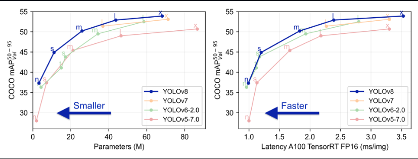
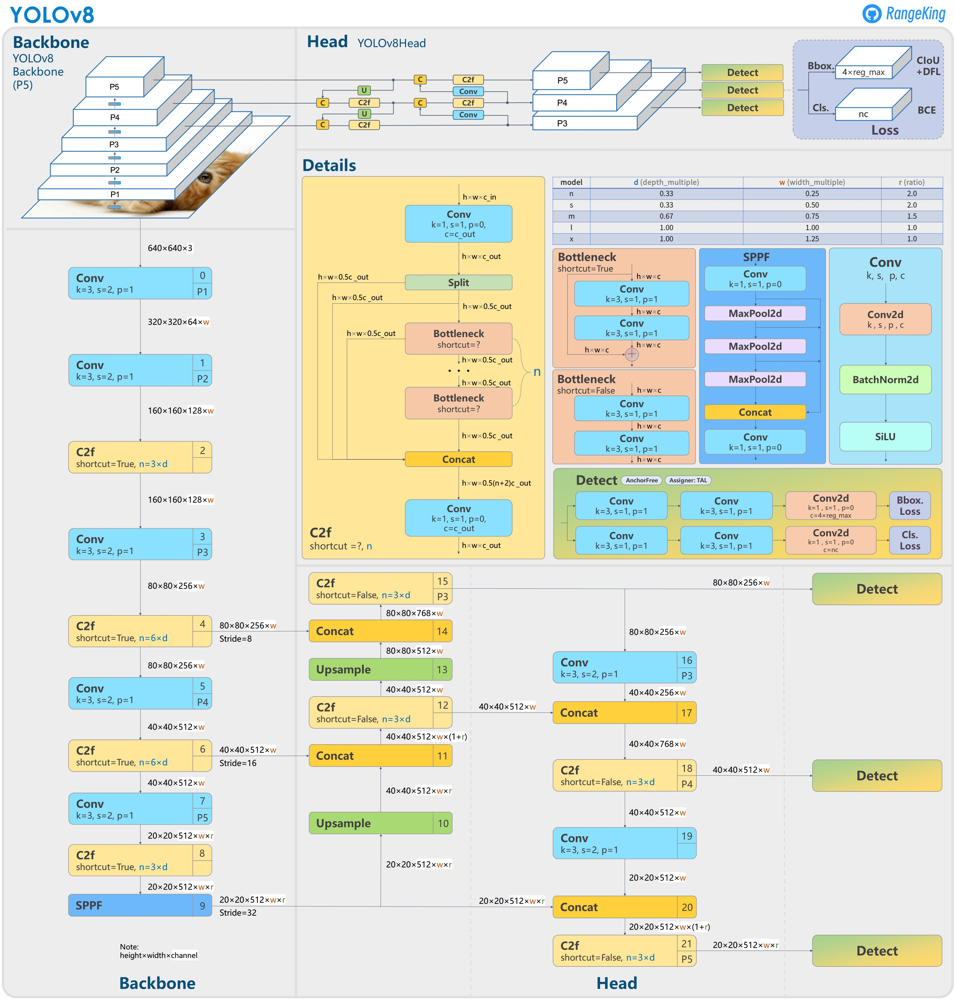

# Bike Rider Helmet Detection

## Computer Vision: Introduction

Computer Vision is an interdisciplinary field of study that enables computers to interpret and understand visual information from the world, much like the human visual system. It encompasses the development of algorithms, models, and systems that can process, analyze, and extract meaningful insights from visual data, typically in the form of images and videos. Computer Vision has wide-ranging applications across various industries, including healthcare, automotive, entertainment, surveillance, robotics, and more. This overview provides a comprehensive understanding of Computer Vision, its key components, applications, challenges, and future prospects.

# Objective / Motivation

Problem: Bike riders drivers who do not wear helmet which may result in fatal accidents and death in some cases.

Goal: Create a ML/DL model that an detect if a person is wearing helmet or not.

# Related Work

Key Components of Computer Vision:

1. Image Acquisition: Computer Vision begins with the acquisition of visual data, which can come from various sources, including cameras, sensors, or image databases.

2. Image Preprocessing: Raw visual data often requires preprocessing to enhance quality, remove noise, and prepare it for analysis. This includes tasks like image resizing, filtering, and color correction.

3. Feature Extraction: Feature extraction involves identifying and isolating relevant visual patterns or features within an image, such as edges, corners, or texture.

4. Object Detection and Recognition: This component focuses on identifying and classifying objects within images or videos. Object detection and recognition algorithms enable computers to recognize and label objects, faces, or specific patterns.

5. Image Segmentation: Image segmentation divides an image into meaningful regions or segments. It's crucial for tasks like medical image analysis, where different parts of an image may represent different anatomical structures.

6. Motion Analysis: Motion analysis techniques track moving objects and can be used in applications like surveillance, sports analysis, and robotics.

7. Scene Understanding: This involves higher-level interpretation of images or videos to understand the context and relationships between objects within a scene.


# Methodology

1) Data Collection:- Collect publicly availabel images / videos of bike rider, helmet and no helmet for the model to train upon. <br />
2) Data pre-processing:- Pre-processing and autolabel images and videos using foundation model like DINO and SAM (Segment anything model).  <br />
3) Train YOLOv8 Model. <br />
4) Evaluate Target Model.   <br />
5) Run Inference on images and videos.  <br />

# Tools and Technologies

## Hardware Requirements :-
1) Desktop / Laptop / Server <br />
2) 8 GB RAM at least <br />
3) 150 GB Disk space or higher   <br />
4) Any processor Intel i5 / AMD    <br />
5) Google GPU - Tesla T4  <br />

## Sofware Requirements :-
1) Windows / Ubuntu os (64 or 32 bit)   <br /> 
2) Google colab / Kaggle jupyter notebook <br />
3) Python 3.10.12 or higher <br />
4) Visual studio code editor, jupyter notebook <br />
5) Sqlite version 0.5.6 or higher

# Implementation details



# What is YOLOv8?
YOLOv8 is from the YOLO family of models and was released on January 10, 2023. YOLO stands for You Only Look Once, and this series of models are thus named because of their ability to predict every object present in an image with one forward pass. <br />

# Why YOLOv8?
YOLOv8 by ultalytics is a state-of-the-art deep learning model designed for real-time object detection in computer vision applications. With its advanced architecture and cutting-edge algorithms, YOLOv8 has revolutionized the field of object detection, enabling accurate and efficient detection of objects in real-time scenarios. <br />

YOLOv8 is quite stable as compare to latest YOLOv9 and recent YOLOv10.

# Dataset information

**Dataset**:- https://www.kaggle.com/datasets/andrewmvd/helmet-detection <br />
It has 764 images of various Bike rider, Rider wearing helmet, Rider not wearing helmet.

Also, only images are needed for this project and no annotations are needed from the data as annotation are generated by ultralytics framework called as Autodistill which uses Grounding SAM which is combination of Grounding DiNO and SAM (Segment Anything Model) from meta for autolabel dataset and train on YOLOv8. <br />

Autodistill uses big, slower foundation models to train small, faster supervised models. Using autodistill, you can go from unlabeled images to inference on a custom model running at the edge with no human intervention in between. <br />

As foundation models get better and better they will increasingly be able to augment or replace humans in the labeling process.

This project consist of a combination of both the images and videos images. Video is processed is such a way in which every 3 (can be changed through code) frame are considered as data for the model to train upon. <br />

For autolabelling the dataset of images and video frame autodistill uses something which is called as ontology

Ontology - an Ontology defines how your Base Model like Grounding SAM is prompted, what your Dataset will describe, and what your Target Model like YOLOv8 will predict. A simple Ontology is the CaptionOntology which prompts a Base Model with text captions and maps them to class names. Other Ontologies may, for instance, use a CLIP vector or example images instead of a text caption.

```python
from autodistill.detection import CaptionOntology
    
    # "<description of label>": "<label_name>"
    # "bike rider": "Bike_Rider", --> label 0
    # "bike rider and passanger with helmet": "Helmet", --> label 1
    # "bike rider and passanger with no helmet": "No_Helmet" --> label 2

ontology=CaptionOntology({
    "bike rider": "Bike_Rider",
    "helmet": "Helmet",
    "no helmet": "No_Helmet"
})
```

What are base models? <br />
Base Model - A Base Model is a large foundation model that knows a lot about a lot. Base models are often multimodal and can perform many tasks. They're large, slow, and expensive. Examples of Base Models are GroundedSAM and GPT-4's upcoming multimodal variant. We use a Base Model (along with unlabeled input data and an Ontology) to create a Dataset.  <br />

What are target models? <br />
Target Model - a Target Model is a supervised model that consumes a Dataset and outputs a distilled model that is ready for deployment. Target Models are usually small, fast, and fine-tuned to perform a specific task very well (but they don't generalize well beyond the information described in their Dataset). Examples of Target Models are YOLOv8 and DETR. <br />

How pre-processing of the dataset is done?  <br />
Dataset is a set of auto-labeled data that can be used to train a Target Model. It is the output generated by a Base Model. <br />
The dataset is then divided into training and validation dataset to check the performance of model.

The YOLOv8 model is fine-tuned for custom dataset target values of **bike rider**, **helmet** and **no helmet**. Based on which best.pt and last.pt pytorch training weights are generated. <br />

For more details regarding the jupyter notebook implementation. Take a look at the below github url <br />
https://github.com/Viddesh1/Helmet_test_1 <br />

Fore more details regarding the implementation of the bike helmet detection web application using django. <br />
Take a look at the below github url:- <br />
https://github.com/Viddesh1/Bike-Helmet-Detection <br />

For more details regarding the implementation of the bike helmet detection web application using streamlit. <br />
Take a look at the below github url. <br />
https://github.com/Viddesh1/Bike-Helmet-Detectionv2.git <br />


# YOLOv8 Architecture

**YOLOv8 architecture are too big please use Netron.app for more detail and simply open best.pt and last.pt model: https://netron.app/?ref=blog.roboflow.com**

 <br /> <br /> 

### best.pt model architecture
  <br /> <br /> 

### last.pt model architecture
  <br /> <br /> 

# Analysis of the result

 <br /> <br /> 
   <br /> <br /> 
   <br /> <br /> 

# Inference on images
 <br /> <br /> 
 <br /> <br /> 
 <br /> <br /> 

   <br /> <br /> 
   <br /> <br /> 

   <br /> <br /> 
   <br /> <br /> 

   <br /> <br /> 
   <br /> <br /> 

# Inference on Video
<!-- <iframe width="700" height="500" src="/yolov8_videos/he2.mp4">
</iframe>

<video style="width:50%" muted="" controls="" alt="type:video">
   <source src="yolov8_videos/he2.mp4" type="video/mp4">
</video>


 

<iframe width="700" height="500" src="/yolov8_videos/test_1.mp4">
</iframe>

<iframe width="700" height="500" src="/yolov8_videos/test_2.mp4">
</iframe> -->

 <br /> <br /> 

# Conclusion

In conclusion, the development of a computer vision model using YOLOv8 for bike rider helmet detection represents a significant advancement in enhancing safety measures for riders. The model demonstrates impressive accuracy and efficiency in identifying helmet-wearing individuals, which is crucial for ensuring compliance with safety regulations and reducing the risk of head injuries in bike-related accidents.

This project highlights the potential of computer vision technology to address real-world safety challenges effectively. 


# Future enhancement

YOLOv9 implementation <br />
YOLOv10 implementation  <br />

# Program code

1) Implementation of Bike Helmet Detection Jupyter Notebook <br />
https://github.com/Viddesh1/Helmet_test_1   <br />

2) Output generated by YOLOv8   <br />
https://drive.google.com/drive/folders/1M4FckJJeyPQTTWqgo6xWhW8L4tf0EJ4l?usp=sharing   <br />

3) Bike Helmet Detection Django Web application <br />
https://github.com/Viddesh1/Bike-Helmet-Detection   <br />

4) Bike Helmet Detection Stremlit Web application   <br />
https://github.com/Viddesh1/Bike-Helmet-Detectionv2 <br />

5) Hosted on Streamlit  <br />
https://bike-helmet-detectionv2-dmehozp3lkef4wnssaepjf.streamlit.app/   <br />

6) Overall Documentation    <br />
https://github.com/Viddesh1/Bike-Helmet-Detection-Docs  <br />


# References
1) https://github.com/ultralytics/ultralytics

2) https://towardsdatascience.com/dino-emerging-properties-in-self-supervised-vision-transformers-summary-ab91df82cc3c

3) https://github.com/facebookresearch/dino

4) Emerging Properties in Self-Supervised Vision Transformers :- https://arxiv.org/abs/2104.14294

5) https://dinov2.metademolab.com/

6) https://segment-anything.com/
