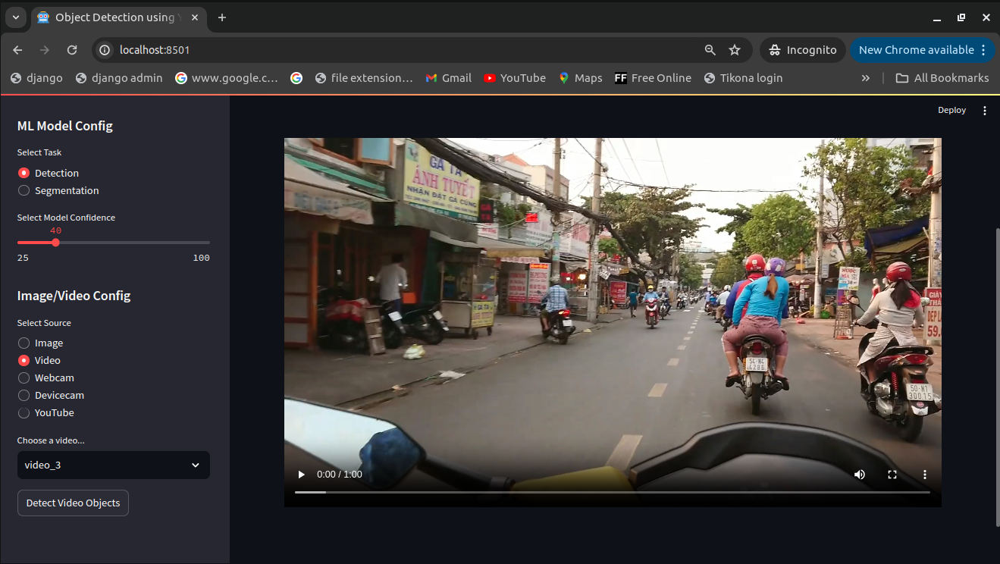

# Bike-Helmet-Detectionv2
This repository contains the Bike Helmet detection using YOLOv8 in streamlit. This web application does processing on end users images and videos to detect **bike rider**, **helmet** and ***no helmet** and render processed images and videos to user.

# Major python libraries used for the project
```text
# Below is the list of the major packages needed for working in this project.

ultralytics==8.1.8 # For running inference using YOLOv8 model
streamlit==1.30.0 # Web application
pillow==10.2.0 # For managing images and videos
pytube==15.0.0 # For running inference on small youtube videos
```

# File Structure
```text
Bike-Helmet-Detectionv2 # Root folder of this github repository
├── app.py  # Start page of the application
├── assets  # Necessary assets for testing
│   ├── BikesHelmets6.png
│   ├── video_1.mp4
│   ├── video_2.mp4
│   └── video_3.mp4
├── .git        # For managing files by git
├── .gitignore  # Files to be not managed by git
├── helper.py
├── images # For rendering Predicted and not predicted to streamlit user interface
│   ├── BikesHelmets6_detected.jpg
│   └── BikesHelmets6.png
├── local_requirements.txt  # For local machine dependencies installation
├── major_packages.txt  # major packages needed for working in this project
├── packages.txt        # Externally insatallion of package by streamlit for deployment
├── README.md   # This readme.md file itself
├── requirements.txt   # For deployment dependencies file
├── runs
│   └── detect
│       └── predict
│           └── BikesHelmets6.png # Predicted image
├── settings.py # Configuration blue print for this streamlit web application
├── videos  # For rendering video into streamlit user interface
│   ├── video_1.mp4
│   ├── video_2.mp4
│   └── video_3.mp4
└── weights # Model weights 
    ├── best.pt # Best model weight as pytorch format
    ├── information.txt # Information related to placing weights
    └── last.pt # Last model weight as pytorch format
```

# How to run this streamlit webapp project locally?
```shell
python3 -m venv .venv
source .venv/bin/activate
git clone https://github.com/Viddesh1/Bike-Helmet-Detectionv2.git
cd Bike-Helmet-Detectionv2/
pip install -r local_requirements.txt # For local
pip install -r requirements.txt # For deployment
streamlit run app.py
```

Note:- If this app is not working locally then please add opencv-python==4.9.0.80 below before opencv-python-headless==4.8.1.78 and opencv-contrib-python==4.8.1.78 in requirements.txt file

```text
opencv-python==4.9.0.80
opencv-python-headless==4.8.1.78
opencv-contrib-python==4.8.1.78
```

# Deployment Pipeline
Continuous delivery is done by streamlit to host on Streamlit Cloud through this Github repository. 

# Demo
## Drag and drop the image for object detections


## Select the video and click Detect Video Objects button


## Works on only web camera
**Please make sure web camera is connected**


## Works on native device camera (Webcam, Smartphone)
**Select respective device and click on start button**


## Insert youtube url and click on Detect Objects button


# Hosted on Streamlit:- 
https://bike-helmet-detectionv2-dmehozp3lkef4wnssaepjf.streamlit.app/

# Also see
1) https://github.com/Viddesh1/Helmet_test_1    <br />
2) https://github.com/Viddesh1/Bike-Helmet-Detection    <br />